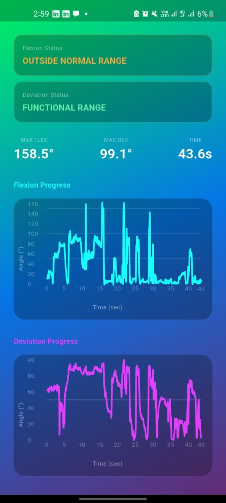
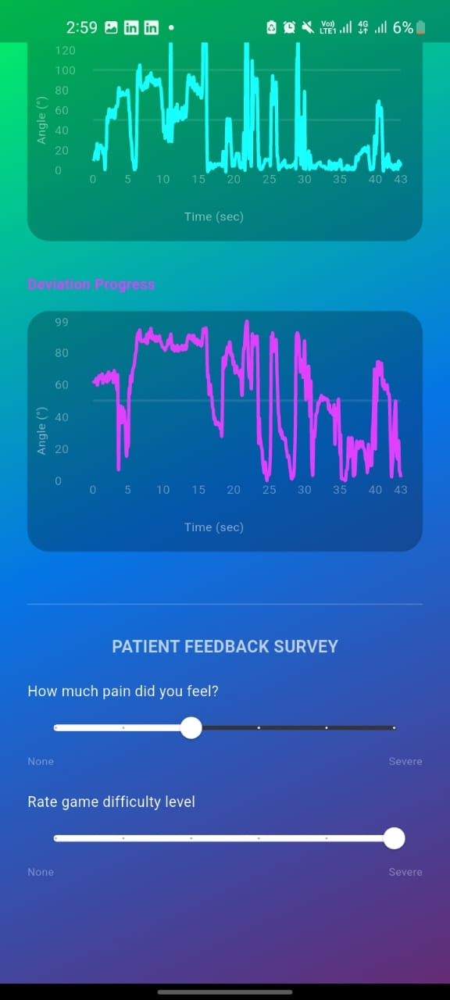

# 🎮 Marble Maze — Mobile-Based Rehabilitation Game

<p align="center">
  
  
  
  
  
</p>

<p align="center">
  <b>A smartphone-based serious game for upper limb motor rehabilitation in patients with stroke, Parkinson's disease, and cerebral palsy.</b>
</p>

---

## 👥 Team Members

| Name | Role |
|---|---|
| Zeyad Abdelfattah | Team Member |
| Amatalrahman Sayed | Team Member |
| Omar Amein | Team Member |
| Ahmed Abdel Moety | Team Member |
| Engy Shenif | Team Member |

---

## 📽️ Demo

### Game DEMO:
https://github.com/user-attachments/assets/8148428a-4fe5-4618-8dcb-32ad8ce38958

### Patient perspective DEMO:
https://github.com/user-attachments/assets/69ad2144-46cc-4780-ae58-e9f8dc05f228

---

## 📌 Table of Contents

1. [Problem Statement & Significance](#-problem-statement--significance)
2. [Solution Overview](#-solution-overview)
3. [How It Works — Technical Deep Dive](#-how-it-works--technical-deep-dive)
4. [Assistive Technology Perspective](#-assistive-technology-perspective)
5. [Relevance to Past & Current Work](#-relevance-to-past--current-work)
6. [Tech Stack](#-tech-stack)
7. [Data Pipeline](#-data-pipeline)
8. [Dashboards & Output](#-dashboards--output)
9. [Screenshots](#-screenshots)
10. [Difficulty & Progression System](#-difficulty--progression-system)
11. [Future Improvements](#-future-improvements)
12. [References](#-references)

---

## 🧠 Problem Statement & Significance

Neurological conditions — including **stroke**, **Parkinson's disease**, and **cerebral palsy** — represent a major global health burden, severely impairing upper limb motor function and diminishing quality of life for millions of patients.

### The Clinical Reality

| Condition | Affected Motor Function | Conventional Treatment |
|---|---|---|
| **Stroke** | Arm and hand weakness, loss of fine motor control | Neurodevelopmental + task-oriented training with high-repetition exercises |
| **Parkinson's Disease** | Resting tremor, rigidity, bradykinesia in the hands | Eccentric exercises, weight training, electrical stimulation |
| **Cerebral Palsy** | Impaired voluntary movement, abnormal muscle tone | Repetitive practice of functional movement routines |

### Why Conventional Therapy Falls Short

Despite being clinically effective, traditional rehabilitation approaches share a critical weakness: **low patient adherence**. The exercises are:

- ❌ **Highly repetitive** and monotonous
- ❌ **Exhausting** and demotivating over time
- ❌ **Clinic-dependent**, limiting access to therapy
- ❌ **Subjective** in outcome tracking — progress often relies on therapist observation rather than objective data

This creates a pressing need for **engaging, accessible, and data-driven rehabilitation tools** that patients will actually want to use consistently and that clinicians can monitor remotely and objectively.

---

## 💡 Solution Overview

**Marble Maze** is a mobile serious game that transforms therapeutic wrist and hand exercises into an enjoyable gameplay experience. The patient tilts their smartphone to navigate a virtual marble through a maze — naturally performing medically prescribed wrist movements in the process.

### Core Therapeutic Movements Engaged

```
Wrist Flexion / Extension        ← Tilting phone forward/backward (pitch)
Radial / Ulnar Deviation         ← Tilting phone left/right (yaw)
Continuous Grip Stability        ← Sustained grip on the device throughout play
```

### Key Design Principles

- 🎯 **Task-specific**: Every movement maps to a clinically relevant rehabilitation exercise
- 📈 **Graded difficulty**: Three progressive stages (early, mid, late recovery) matching the patient's current capability
- 📊 **Objective monitoring**: Continuous automated logging of biomechanical and performance data
- 🤝 **Adjunct therapy**: Designed to complement, not replace, in-clinic physiotherapy sessions
- 📱 **Accessible**: Runs on any standard smartphone — no special hardware needed beyond the device itself

---

## 🔧 How It Works — Technical Deep Dive

### System Architecture

```
┌─────────────────────────────────────────────────────────────┐
│                        SMARTPHONE                           │
│                                                             │
│  ┌──────────────┐    ┌─────────────────────────────────┐   │
│  │  IMU Sensor  │───▶│     Flutter App (Android)        │   │
│  │  (Accel/Gyro)│    │  - UI / Patient Interaction      │   │
│  └──────────────┘    │  - Sends tilt data to Unity      │   │
│                      └──────────────┬──────────────────-┘   │
│                                     │                        │
│                      ┌──────────────▼──────────────────-┐   │
│                      │     Unity Game Engine            │   │
│                      │  - Maze rendering & physics      │   │
│                      │  - Marble movement logic         │   │
│                      │  - Difficulty management         │   │
│                      └──────────────┬──────────────────-┘   │
└─────────────────────────────────────┼───────────────────────┘
                                      │
                         ┌────────────▼────────────┐
                         │  Firebase Realtime DB    │
                         │  - Kinematic angles      │
                         │  - Game metrics          │
                         │  - Session history       │
                         └────────────┬────────────┘
                                      │
              ┌───────────────────────┼────────────────────────┐
              │                       │                         │
   ┌──────────▼──────────┐  ┌────────▼────────────────────────┐│
   │  Patient Dashboard  │  │      Clinician Dashboard        ││
   │  - Win/Loss         │  │  - ROM graphs (pitch & yaw)     ││
   │  - Completion %     │  │  - Max tilt angles              ││
   │  - Time & retries   │  │  - Longitudinal progress        ││
   │  - Self-report form │  └─────────────────────────────────┘│
   └─────────────────────┘                                      │
                                                                │
```

### Sensor Fusion & Signal Processing

The smartphone's **Inertial Measurement Unit (IMU)** provides raw accelerometer readings. These undergo the following processing pipeline:

#### 1. Low-Pass Filtering

Raw accelerometer data contains high-frequency noise — particularly hand tremors inherent in conditions like Parkinson's disease. A low-pass filter is applied with smoothing factor **α = 0.2**:

```
filtered_value = α × raw_value + (1 − α) × previous_filtered_value
```

A smaller α gives heavier smoothing, ensuring that **only deliberate wrist movements** — not involuntary tremors — drive the marble's motion and are counted in performance metrics.

#### 2. Angle Calculation

From the filtered accelerometer data, two therapeutic angles are derived:

```
Flexion Angle (Wrist Flex/Extension):
  θ_flexion = arctan2(a_y, a_z)

Deviation Angle (Radial/Ulnar):
  θ_deviation = arctan2(a_x, a_z)
```

Where `a_x`, `a_y`, `a_z` are filtered accelerations along the three axes.

#### 3. Kinematic Metrics Extracted

| Metric | Clinical Relevance |
|---|---|
| **Maximum Tilt Angle (Flexion)** | Measures wrist flexion/extension ROM |
| **Maximum Tilt Angle (Deviation)** | Measures radial/ulnar deviation ROM |
| **Tilt Smoothness** | Reflects motor control quality and tremor severity |
| **Session-over-Session Trends** | Tracks neuroplastic recovery over time |

### Game Engine Integration (Unity + Flutter)

- **Unity** handles all real-time 3D physics, maze rendering, marble dynamics, and collision detection
- **Flutter** manages the native Android UI, wraps the Unity view, handles Firebase read/write, and renders both dashboards
- **Android Studio** is used for build configuration and device deployment
- **Visual Studio** is the IDE for Unity C# scripting

---

## ♿ Assistive Technology Perspective

Marble Maze sits at the intersection of **serious games**, **mHealth (mobile health)**, and **assistive rehabilitation technology**. Here's how it addresses key AT principles:

### 1. Universality & Accessibility
The solution requires only a consumer smartphone — a device patients already own. There is no need for expensive robotic exoskeletons, clinical-grade sensors, or specialized equipment. This democratizes access to objective, data-driven rehabilitation for patients who cannot afford or access high-tech clinical solutions.

### 2. Neuroplasticity Through High-Repetition Practice
A cornerstone of motor rehabilitation is that **neuroplasticity is driven by repetition**. The game naturally encourages hundreds of wrist movements per session without the patient consciously counting or becoming fatigued by monotony. The motivational game loop (completing mazes, advancing levels) sustains engagement far beyond what traditional exercise would achieve.

### 3. Graded Therapeutic Challenge
The difficulty system adapts to the user's current motor capability, a concept aligned with the **Zone of Proximal Development** and **progressive overload** principles in rehabilitation science:

| Recovery Stage | What Changes |
|---|---|
| **Early** | Wider maze paths, lenient tilt sensitivity, generous time limits, more error allowances |
| **Mid** | Narrower paths, sharper turns, tighter timing, reduced retries |
| **Late** | Fine motor precision required, high sensitivity, minimal error tolerance |

### 4. Dual-Channel Feedback Loop
The system closes the rehabilitation feedback loop for both stakeholders:
- **Patient**: Immediate intrinsic motivation (game win/loss, progress) + self-reflection (survey)
- **Clinician**: Objective, quantified biomechanical data to inform therapy adjustments — replacing subjective observation with measurable ROM and movement quality metrics

### 5. Home-Based Rehabilitation Enablement
By removing the need for clinic visits for every exercise session, the app enables **independent home rehabilitation**, increasing therapy dose (critical for neuroplastic recovery) without burdening healthcare resources.

---

## 📚 Relevance to Past & Current Work

### Evolution of Motor Rehabilitation Technology

```
Traditional PT ──▶ Robotic Exoskeletons ──▶ Sensor-Based Games ──▶ Marble Maze
   (1990s–)            (2000s–)                 (2010s–)              (Now)
Low cost but      High efficacy but           Engaging but often    Accessible,
low adherence     expensive & clinic-bound     lacking clinical      engaging, AND
                                               validation            clinically tracked
```

### Alignment with Current Evidence

| Reference | Finding | How Marble Maze Addresses It |
|---|---|---|
| Johansen et al. (2023) — *J Rehabil Assist Technol Eng* | Robot-assisted arm exercise improves arm/hand function in stroke survivors | Marble Maze achieves functionally similar task-specific upper limb training without robotic hardware |
| Shahien et al. (2022) — *Neurol Sci* | Physical therapy (eccentric exercise, stimulation) manages Parkinson's hand tremors | The app's low-pass filter isolates deliberate movement from tremor, enabling safe, progress-tracking exercise despite tremor |
| Ahn S.N. (2023) — *Int J Environ Res Public Health* | Scoping review confirms serious game-based rehab is effective for cerebral palsy | Marble Maze directly implements evidence-backed game-based rehab principles with objective metric logging |

### Positioning vs. Existing Serious Games

Most existing rehabilitation games either:
- Use expensive external hardware (sensor gloves, motion capture)
- Lack integrated clinician-facing dashboards
- Do not extract or report standardized clinical metrics (ROM)
- Are designed for a single condition, not adaptable across stroke/PD/CP

**Marble Maze's differentiator** is the combination of: zero additional hardware cost + graded therapeutic difficulty + dual-dashboard objective tracking + cross-condition applicability — all in a single mobile application.

---

## 🛠️ Tech Stack

| Layer | Technology | Purpose |
|---|---|---|
| **Game Engine** | Unity Engine | 3D maze physics, marble simulation, difficulty logic |
| **IDE (Game)** | Visual Studio | C# scripting for Unity |
| **App Framework** | Flutter | Cross-platform Android UI, dashboard rendering |
| **IDE (App)** | Android Studio | Android build, device deployment |
| **Hardware Sensor** | Smartphone IMU (Accelerometer) | Captures wrist kinematic angles in real time |
| **Database** | Firebase Realtime Database | Cloud storage for telemetry and game metrics |

---

## 📡 Data Pipeline

### Data Captured

**Hardware Telemetry (IMU)**
- Continuous X-axis acceleration → Radial/Ulnar deviation angle
- Continuous Y-axis and Z-axis acceleration → Wrist flexion/extension angle
- Sampling throughout entire gameplay session

**In-Game Performance Metrics**
- Maze completion percentage
- Time elapsed per level
- Number of retries required
- Maximum difficulty level reached
- Win/Loss outcome

### Processing Flow

```
Raw IMU Data
     │
     ▼
Low-Pass Filter (α = 0.2)       ← Removes tremor noise
     │
     ▼
Angle Calculation               ← arctan2 for flexion & deviation
     │
     ▼
Statistical Analysis            ← Extract max ROM, smoothness index
     │
     ▼
Firebase Upload                 ← Persistent session storage
     │
     ▼
Dashboard Visualization         ← Patient & Clinician views
```

---

## 📊 Dashboards & Output

### Patient Dashboard
Provides immediate post-session feedback:
- ✅ Win / ❌ Loss result
- 🏁 Maze completion percentage
- ⏱️ Time taken
- 🔄 Number of retries
- 📝 Self-report wellbeing & difficulty survey

### Clinician Dashboard
Provides objective biomechanical monitoring:
- 📐 Maximum ROM achieved (flexion and deviation, in degrees)
- 📈 Graphical time-series of tilt angles per session
- 📉 Longitudinal recovery trend across sessions
- 🔢 Quantitative progress markers vs. normal functional range

---

## 📸 Screenshots

### Clinician ROM Dashboard, Patient Survey & Gameplay

> *Figure 1: Clinician ROM dashboard (top left), patient survey (top right), and gameplay state (bottom).*





---

## 🎯 Difficulty & Progression System

The game employs a **graded difficulty framework** that dynamically adapts challenge parameters as the user's motor control improves:

| Parameter | Early Recovery | Mid Recovery | Late Recovery |
|---|---|---|---|
| **Maze Path Width** | Wide | Medium | Narrow |
| **Turn Sharpness** | Gradual | Moderate | Sharp |
| **Tilt Sensitivity** | Low | Medium | High |
| **Time Limit** | Generous | Standard | Strict |
| **Error Allowance** | High | Moderate | Minimal |

This ensures the game remains within the patient's **therapeutic window** — challenging enough to stimulate motor learning, but not so difficult as to cause frustration or unsafe movement compensations.

---

## 🔮 Future Improvements

- [ ] **Extended Level Library** — Additional maze configurations targeting finer wrist movement precision (e.g., small-amplitude deviation control)
- [ ] **Win/Loss Visualization** — Historical tracking of patient success/failure patterns visualized as engagement analytics
- [ ] **Angular Velocity Metrics** — Inclusion of angular velocity data (max value per direction + time-series graphs) in the clinician report, enabling assessment of movement speed alongside range
- [ ] **iOS Support** — Flutter cross-compilation to iOS for broader accessibility
- [ ] **Multiplayer / Leaderboard Mode** — Social engagement features to drive motivation through friendly competition
- [ ] **Adaptive Filter Tuning** — Personalized α values per patient based on their tremor profile

---

## 📄 References

1. Johansen, T., et al. (2023). *Effectiveness of robot-assisted arm exercise on arm and hand function in stroke survivors.* Journal of Rehabilitation and Assistive Technologies Engineering.

2. Shahien, M., et al. (2022). *Physical therapy interventions for the management of hand tremors in patients with Parkinson's disease.* Neurological Sciences.

3. Ahn, S. N. (2023). *A Scoping Review of the Serious Game-Based Rehabilitation of People with Cerebral Palsy.* International Journal of Environmental Research and Public Health.

---

<p align="center">
  Made with ❤️ for better rehabilitation outcomes · Biomedical Engineering Senior Project
</p>
